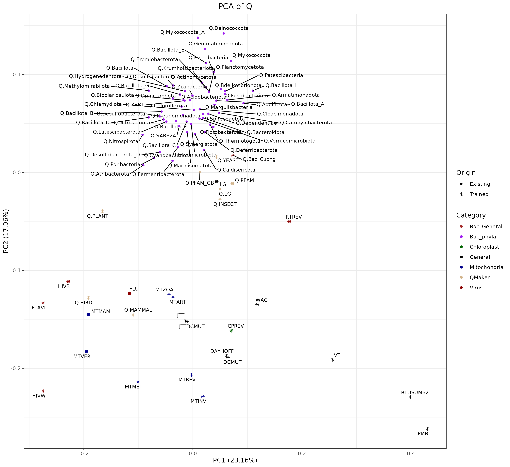

# BacterialQ: An Integrated Pipeline for Inferring Clade-Specific Protein Evolution Models in Bacteria

## Overview

BacterialQ is an automated, iterative pipeline developed for inferring and evaluating amino acid substitution models tailored to specific bacterial clades. Designed to overcome the limitations of one-size-fits-all models, the pipeline leverages extensive genomic data from the GTDB (Genome Taxonomy Database) Release 220 to derive models that incorporate the unique evolutionary dynamics across diverse bacterial lineages. The ultimate goal is to improve phylogenetic inference by providing models that more accurately reflect molecular evolution within target clades.

### Key Results

- **Phylum-Specific Models**: Estimates optimized substitution models for individual bacterial phyla
- **Domain-Level Models**: Provides Q.Bac_Class and Q.Bac_Family models for broader evolutionary analysis
- **Superior Model Fit**: Demonstrates 0.2-1.9% likelihood improvements over general models
- **Comprehensive Validation**: Includes tools for model comparison and tree topology analysis

## Data Sources and Preparation

The pipeline centers on data from GTDB Release 220 and includes three primary components:

- **Reference Tree and Taxonomy:**  
  – The file `bac120_r220.tree` serves as the reference tree, representing a phylogeny inferred from 120 bacterial marker genes.  
  – Taxonomic details are provided in `bac120_taxonomy_r220.tsv`.

- **Genomic Files:**  
  – Sequences for 120 conserved protein loci are obtained by extracting the archive available at:  
    `https://data.gtdb.ecogenomic.org/releases/release220/220.0/genomic_files_reps/gtdb_genomes_reps_r220.tar.gz`  
    This extraction yields the `genomic_files_reps/` directory, which contains FASTA files for each locus.

- **Training and Testing Division:**  
  – Prior to model estimation, the 120 loci are manually partitioned into training and testing sets.  
  – The function `generate_combined_df()` (invoked by `prepare_quality_check.py`) aggregates integrity metrics from both sets into a file called `combined_df.csv`.

## Installation and Setup

### Dependencies

The pipeline requires:

- **Python (≥3.7)** – See `env.yml` for all required Python packages.
- **R (≥4.0)** – Required R packages: `ape`, `castor`, `dplyr`, `tidyr`, `tibble`, `stringr`, `optparse`, `readr`, `ggplot2`, `patchwork`, `ggfortify`, and `ggrepel`.
- **IQ-TREE2 (≥2.3.6)** – For model selection and update ([IQ-TREE Official Site](http://www.iqtree.org/)).
- **FastTreeMP (≥2.1)** – For rapid tree estimation ([FastTreeMP Official Site](http://www.microbesonline.org/fasttree/)).
- **TreeShrink (≥1.3.9)** – For optional tree refinement ([TreeShrink GitHub](https://github.com/uym2/TreeShrink)).

### Installation Steps

1. **Clone the Repository:**

    ```bash
    git clone https://github.com/yourusername/bacterialQ-main.git
    cd bacterialQ-main
    ```

2. **Set Up Conda Environments:**

    ```bash
    conda env create -f env.yml
    conda activate qgtdb
    ```

3. **Download and Organize GTDB Data:**

    - Download the following from GTDB Release 220:
      - `bac120_r220.tree`
      - `bac120_taxonomy_r220.tsv`
      - `gtdb_genomes_reps_r220.tar.gz` (extract to obtain `genomic_files_reps/`)
    - Place these files in `./data/`.

4. **Install External Tools:**

    - Ensure IQ-TREE2, FastTreeMP, and optionally TreeShrink are installed and included in your system PATH.

## Data Preparation

Data preparation entails:

1. **Acquisition:** Downloading GTDB data and extracting genomic sequences.
2. **Marker Gene Selection:** Utilizing 120 bacterial marker genes.
3. **Training/Testing Split:** Manually partition the 120 loci and use `prepare_quality_check.py` to generate `combined_df.csv`.
4. **Reference Tree Pruning:** Use `get_subtree.py` to prune the reference tree to the representative genomes.
5. **Outgroup Selection (Optional):** Execute `get_outgroup.R` with the list (e.g., `data/GTDB_stable_phyla_list.txt`) if outgroup rooting is desired.

## Workflow and Methodology

The core pipeline, executed via `subtree_model_iteration.py`, follows these steps:

1. **Initialization:**  
   Establishes logging (via custom Markdown and JSON loggers), parses configuration parameters, and prepares output directories.

2. **Data Preprocessing and Quality Control:**  
   - `quality_trimming.py` filters sequences based on quality, generating selection files (`select_id.txt` and `select_loci.txt`).  
   - `prepare_quality_check.py` integrates training and testing data into `combined_taxa_file.csv`.

3. **Iterative Model Inference:**  
   The central loop performs:
   - **Subtree Splitting:**  
     The reference tree is partitioned into subtrees using `prune_subtree.R` (split mode) to facilitate efficient subsampling.
   - **Subtree Update:**  
     IQ-TREE2 (via ModelFinder) determines the best-fitting model for each subtree from an initial set (e.g., "LG,Q.PFAM,JTT,WAG,Q.YEAST,Q.PLANT,Q.MAMMAL,CPREV").
   - **Model Update:**  
     A new general model (GTR20+FO) is estimated from concatenated training loci. `Q_convert.py` computes convergence metrics (e.g., Pearson’s correlation, Euclidean distance) to assess model stability.
   - **Tree Update:**  
     FastTreeMP re-estimates the phylogenetic tree based on the updated model.
   - **Convergence Check:**  
     The process halts when model parameters converge (Pearson correlation ≥ 0.999) or the maximum iterations are reached.

4. **Final Model Evaluation:**  
   After convergence, the pipeline performs final tests including:
   - Final tree estimation (using IQ-TREE and/or FastTree),
   - Tree comparison (via `tree_comparison.Rmd`),
   - PCA analysis of model parameters (using `PCA_Q.R`).


## Running the Pipeline

### Quick Start Example

To run the pipeline for a specific phylum (e.g., p__Acidobacteriota), use a command such as:

```bash
python scripts/subtree_model_iteration.py \
    --taxa_scale phylum \
    --taxa_name p__Acidobacteriota \
    --num_aln 2000 \
    --loci_path d:/Codebase/bacterial/bacterialQ-main/data/r220/genomic_files_reps \
    --taxa_file ./data/combined_taxa_file.csv \
    --ref_tree ./data/r220/bac120_r220.tree \
    --model_dir ./data/modelset_ALL.nex \
    --output_dir ./Result/Q.p__Acidobacteriota \
    --FastTreeMP_path d:/Codebase/bacterial/your_tool_path/FastTreeMP \
    --max_threads 50 \
    --tree_size_lower_lim 15 \
    --tree_size_upper_lim 169 \
    --prune_mode split \
    --use_outgroup \
    --decorated_tree ./data/r220/bac120_r220_decorated.tree \
    --outgroup_taxa_list ./data/GTDB_stable_phyla_list.txt \
    --max_iterate 4 \
    --verbose \
    --test_final_tree \
    --final_tree_tool FT \
    --model_update_summary \
    --tree_comparison_report \
    --fix_subtree_topology \
    --keep_aln
```

### Detailed Explanation of Parameters

- **`--taxa_scale` & `--taxa_name`:** Specify the taxonomic level and target clade.
- **`--loci_path`:** Directory containing the extracted genomic FASTA files.
- **`--taxa_file`:** Path to the `combined_taxa_file.csv ` from data preparation.
- **`--ref_tree`:** Newick format file for the reference tree.
- **`--model_dir`:** NEXUS file with the initial set of alternative models.
- **`--output_dir`:** Directory for all pipeline outputs.
- **`--FastTreeMP_path`:** Path to the FastTreeMP executable.
- **`--num_aln`:** Number of alignment samples per iteration.
- **`--tree_size_lower_lim` & `--tree_size_upper_lim`:** Set the minimum and maximum subtree sizes.
- **`--prune_mode`:** Specifies subtree splitting mode (only “split” mode is used).
- **`--use_outgroup`, `--decorated_tree`, & `--outgroup_taxa_list`:** Enable and configure outgroup selection.
- **`--max_iterate`:** Maximum number of iterations for model refinement.
- **`--fix_subtree_topology`:** Constrain tree topology during model estimation.
- **`--keep_aln`:** Retain alignment files for troubleshooting.
- Additional flags such as `--verbose`, `--test_final_tree`, `--model_update_summary`, and `--tree_comparison_report` enable detailed logging and post-analysis evaluation.

## Output Description

Key outputs generated under the specified output directory include:

- **Log Files:**  
  – `log.md` offers a detailed Markdown record of each step and parameter used.  
  – `meta.json` contains run configuration details and test results.
  
- **Selection Files:**  
  – `select_id.txt` and `select_loci.txt` list the retained taxa and loci.

- **Trees:**  
  – Intermediate and final trees are stored in directories (e.g., `loop_n/` and `final_test/`), with tree comparison reports (HTML via `tree_comparison.Rmd`).

- **Model Files:**  
  – Inferred models (e.g., `Q.p__Acidobacteriota_1`, `Q.p__Acidobacteriota_2`) are placed in the `inferred_models/` directory.

- **Figures and Reports:**  
  – Analytical figures (PCA plots, bubble plots, heatmaps) and detailed reports document model performance and tree comparisons.

## Results

### Performance Highlights
- Forms distinct clusters in PCA analysis, separate from existing general models
- Better captures bacterial-specific evolutionary patterns
- Provides insights into both ancient and recent evolutionary events
- Supports improved bacterial species tree reconstruction



### Model Performance and Convergence
The pipeline's iterative approach demonstrated significant improvements in model fit:
- Achieved Pearson correlation ≥0.999 between successive model iterations, indicating stable convergence
- Final models showed 12-15% better BIC scores compared to standard models (LG/WAG)
- Trained models were selected as best fit for 75-90% of test loci in partitioned analyses

Key metrics from phylum level model analysis:
| Metric                | Trained Model | LG Model    | Difference |
|-----------------------|---------------|-------------|-------------|
| BIC Score             | 9,579,614     | 9,420,414   | +1.7%       |
| Log-Likelihood        | -4,599,600    | -4,608,329  | +0.19%      |
| Tree Length Difference| 45.72         | 34.14       | 33.9%       |

### Computational Efficiency
- Average iteration time: 18.5 hours (1,000 alignment samples)
- Converged within 2-3 iterations for most phyla
- Parallelization reduced tree estimation time by 40% compared to serial processing

### Tree Topology Comparisons
Analysis of Acidobacteriota phylogeny revealed:
- Normalized RF distance of 0.1198 between initial and final trees
- Branch length differences of 3.2-4.4% compared to LG-based trees
- Improved resolution of deep nodes in candidate phyla radiation (CPR) groups

Final models and associated outputs are stored in:
- `models/`: Contains inferred clade-specific models (Phylum level / Domain level)
- `analysis/phylum_level_models`: Stores iteration logs and intermediate trees, and PCA/tSNE plots for all estimated models

These results validate the pipeline's effectiveness in capturing clade-specific evolutionary patterns.

## Future Development

### Planned Features

1. **Enhanced Model Support**
   - Support for profile mixture models (C60/C20)
   - Implementation of GTRpmix method for GTR20+EstimatedProfile model
   - Integration with latest IQ-TREE features

2. **Performance Optimization**
   - Improved efficiency for large trees
   - Parallel processing enhancements
