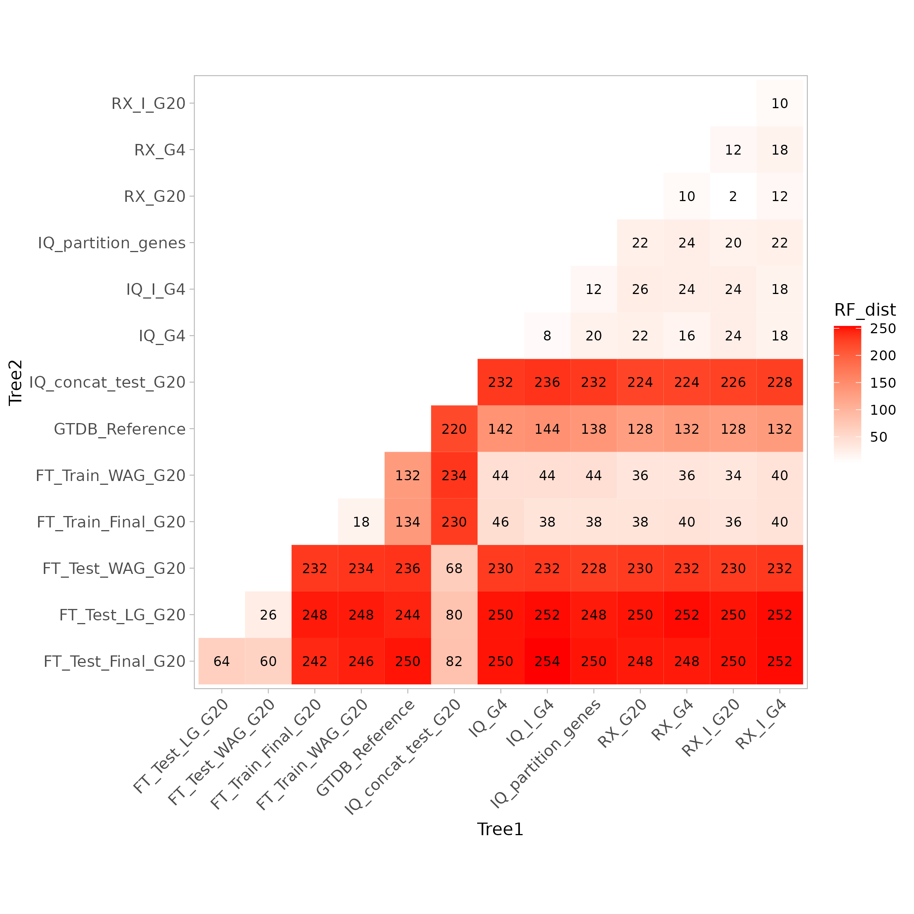

## Introduction
The purpose of this analysis is to identify why the new tree estimates obtained from our model inference pipeline perform poorly on the concatenated test set alignments under the new model. In our model pipeline, the initial alignment of 120 loci is directly divided into training and test sets in a 10:2 ratio, respectively, and is used for new model inference and validation. In most of our tests, we use the concatenated test set loci to evaluate whether the new model and the new tree perform better. Specifically, we use the `-mset` option in IQ-TREE2 to select the best model from our new inferred model and some existing models that we think they could fit bacteria better(LG,Q.PFAM,Q.INSECT,Q.PLANT,Q.YEAST,MTMET,MTART), and use `-te` to fix the tree topology, letting IQTREE output the list of best log-likelihood and BIC for each model under the constrained tree. We perform this test for both the GTDB reference tree and our new estimated tree as the constraint with the concatenated test loci.  

We apply this test on the *phylum Gemmatimonadota*(535 taxa). Finally, we should obtain the following two-way table, which summarizes the best BIC (Bayesian Information Criterion) values for the test set under two tree topologies and two types of models (inferred model and existing model):  

| BIC | Final tree | Reference tree | Tree diff |
|-------|------------|----------------|-----------|
| Inferred model | 1387521.7470 | 1387821.7970 | -300.0500 |
| Existed model | 1392371.5100 | 1392673.8980 | -302.3880 |
| Model diff | -4849.7630 | -4852.1010 | M+/T- |

The table indicates that the new model achieved better BIC values under both the new tree and the GTDB reference tree. However, the new tree we obtained had worse BIC values compared to the reference tree. This suggests that while our new model better fits the alignment of the test set, the new tree does not.  
To check if this is caused by overfitting, tools(we estimate the new tree by FastTree with gamma rate option) or the difference between training and test dataset, we estimated a bunch of new trees to find the reason. v
## More trees
First, to obtain the best tree inference under the training set, we use the `-p` option in IQ-TREE to establish a separate partition for each site in the training set, allowing each partition to use an independent evolutionary model to infer a unified tree. We use the `-t` option to set the GTDB reference tree as the starting tree. We refer to this tree as `IQ_partition_genes`, and we consider it the best tree inference outside the reference tree.  

Second, since FastTree only provides 20 categories of Gamma parameters as a method for rate heterogeneity, but our new model is inferred in IQ-TREE, most of the alignments in the new model optimization use +I+F/G{4-6}, which allows for invariable sites and multiple continuous/discrete gamma rates. Therefore, we need to confirm whether the bias in the rate heterogeneity method is causing the new model's tree topology to be misled in FastTree. Based on this, we use raxml-NG to apply four rate heterogeneity methods (+G4, +G20, +I+G4, +I+G20) to the new model on the training set to determine whether different rate heterogeneity options affect the final model inference. We refer to these four models as `RX_G4, RX_G20, RX_I_G4, RX_I_G20`.  

To verify whether raxml-NG and IQ-TREE produce biased tree predictions under the same parameter settings, we apply IQ-TREE to infer trees using only the `+G4` and `+I+G4` options (also under the new model and training set). We refer to these two models as `IQ_G4, IQ_I_G4`.  

Then, to verify whether the poor performance of the new tree was due to biases in the training and test datasets, we used the same parameters in FastTree to separately analyze the training and test datasets. We also used our new model (Final Model) and the WAG and LG models, which were used to generate the reference tree in GTDB, for tree prediction. Consequently, we obtained the following new trees: `FT_Test_Final_G20, FT_Test_LG_G20, FT_Test_WAG_G20, FT_Train_Final_G20, FT_Train_WAG_G20`. The naming format for the trees is {tool}\_{dataset}\_{model}\_{RHAS}.  

Adding that the GTDB reference tree, we finally get 14 trees in our analysis:

| Tree Name           | Dataset | Model | RHAS |
| ------------------- | ------- | --------------- | --------------- |
| FT_Test_Final_G20   |    testing      |    Final model   |   G20   |
| FT_Test_LG_G20      |    testing      |    LG   |   G20   |
| FT_Test_WAG_G20     |    testing      |    WAG   |   G20   |
| FT_Train_Final_G20  |    training     |    Final model   |   G20   |
| FT_Train_WAG_G20    |    training     |    WAG   |   G20   |
| GTDB_reference_tree |  All taxa data  |    WAG   |   G20   |
| IQ_G4               |    training     |    Final model   |   G4   |
| IQ_I_G4             |    training     |    Final model   |   I+G4   |
| IQ_partition_genes  |    training     |    Flexible on loci   |   Flexible on loci   |
| RX_G4               |    training     |    Final model   |   G4   |
| RX_G20              |    training     |    Final model   |   G20   |
| RX_I_G4             |    training     |    Final model   |   I+G4   |
| RX_I_G20            |    training     |    Final model   |   G20   |

## Best tree on testing loci
We empolyed the tree topology test with IQ-TREE in `-z` option with 14 trees described above and with the concatenated test alignment and final model + G20 rate parameter. This test will firstly estimating the best tree within current alignment and model setting, and optimize the rate parameter based on the estimated tree. Finally, the new model parameters would be applied to check the log-likelihood in the tree set containing our 14 trees estimated in different methods. The logfiles is in [tree test log](./tree_topology_test)  

The result is:

| Tree Name           | Dataset | Model | RHAS | LogL |
| ------------------- | ------- | --------------- | --------------- | --------------- |
| FT_Test_Final_G20   |    testing      |    Final model   |   G20   |  -1479565.356  |
| FT_Test_LG_G20      |    testing      |    LG   |   G20   |  -1479548.801  |
| FT_Test_WAG_G20     |    testing      |    WAG   |   G20   |  -1479457.017  |
| FT_Train_Final_G20  |    training     |    Final model   |   G20   |  -1483892.757  |
| FT_Train_WAG_G20    |    training     |    WAG   |   G20   |  -1484000.940  |
| GTDB_reference_tree |  All taxa data  |    WAG   |   G20   |  -1482463.267  |
| IQ_G4               |    training     |    Final model   |   G4   |  -1484105.129  |
| IQ_I_G4             |    training     |    Final model   |   I+G4   |  1484169.520  |
| IQ_partition_genes  |    training     |    Flexible on loci   |   Flexible on loci   |  -1484085.721  |
| IQ_concat_test_G20  |    testing      |    Final model   |   G20   |  -1479180.269  |
| RX_G4               |    training     |    Final model   |   G4   |  -1484076.312  |
| RX_G20              |    training     |    Final model   |   G20   |  -1484093.907  |
| RX_I_G4             |    training     |    Final model   |   I+G4   |  -1484055.592  |
| RX_I_G20            |    training     |    Final model   |   G20   |  -1484128.683  |

While the tree searched in this test in IQTREE is named as IQ_concat_test_G20.  
We get the order of those trees are:  
FT_test_Final_G20 > FT_test_WAG_G20 >> GTDB reference >> FT_Train_Final_G20 > FT_Train_WAG_G20 > raxml-NG/IQ-TREE trees  

From this, it can be seen that the trees inferred from the test set are significantly superior to those obtained from any training set. Additionally, the trees derived from the training set perform worse than the GTDB (Genome Taxonomy Database) reference tree predicted using the information from all loci. In comparison, the likelihood differences caused by the selection of models and rate parameters are almost negligible.  

## Topology between trees
We also created heatmaps for the RF distance(Robinson–Foulds distance) and nRF distance(normalised Robinson–Foulds distance) between the various trees. First, let's see the RF distance.  
  
The second page is about nRF distance:  
  

Based on the two images above, we can draw the following conclusions:

1. The dataset used for tree inference accounts for the majority of the differences observed.  
2. Even when the same parameters and dataset settings are enforced, the tree inferred by IQ-TREE still differs significantly from the one inferred by FastTree. Interestingly, the tree inferred by IQ-TREE using the Final model is more similar to the tree inferred by FastTree using the WAG model, rather than the one using the Final model.   
3. In RAxML, the impact of adding the +I option when estimating G4 is much greater than when estimating G20. More discrete rate categories somewhat mitigate the effect of +I, but note that this is for my dataset with an extremely long evolutionary history. In IQ-TREE, the results obtained with +G4 and +I+G4 are almost identical.  
4. The differences caused by the tools used (IQ-TREE and RAxML-NG) are greater than the differences caused by the choice of rate parameters. The tree estimated by FastTree differs more from the trees estimated by the other two tools.  
5. Among all the models, none is very close to the GTDB reference tree. The smallest RF distance between trees is 128, and the smallest nRF distance is 0.1203. Trees obtained using the same tool and settings (but different datasets) also differ significantly from the reference tree.
6. In FastTree, the tree obtained using the final model on the training set is very similar to the one obtained using the WAG model.  

Therefore, we can summarize the factors affecting tree inference as follows:  
Dataset (selection of sites) >> Tree inference tool > Model selection/rate heterogeneity parameters.  

## Conclusion
In summary, we found that the primary reason for the poor performance of the predicted trees on the training set is the difference between the test set and the training set. Since both directly specified trees and constrained tree topologies suggest that the trees inferred from the training set are inferior to the reference tree and the trees obtained from the test set, the source of this difference is not the evolutionary rate differences between the training and test set loci, but rather the divergent evolutionary histories between the loci of the test set and the training set. Therefore, directly using the concatenated data of all loci to validate and generate the final tree may better reflect the true situation, although this may compromise some of the test's credibility (by not completely separating the test and validation sets). Regarding the methods used in the model inference process, using IQ-TREE or RAxML-NG may result in a 3%-5% difference in the normalized Robinson-Foulds (nRF) distance or about 4% difference branches, but this should not significantly affect the overall quality of the model.  

## Todo
- [ ] Allow IQ-TREE to estimate tree in model infer pipeline.
- [ ] Distinguish how the model is different to both testing and training set with all the data concatenated to infer the tree in FastTree and IQ-TREE.
- [ ] Check the tree output for the best tree for each loci in topology test.
