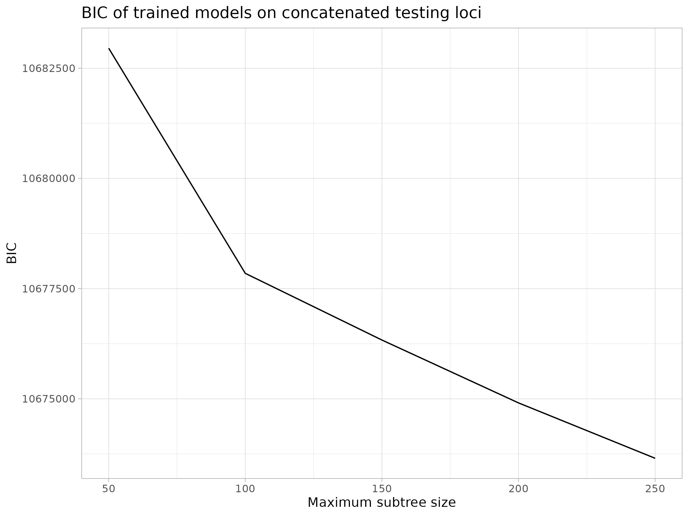
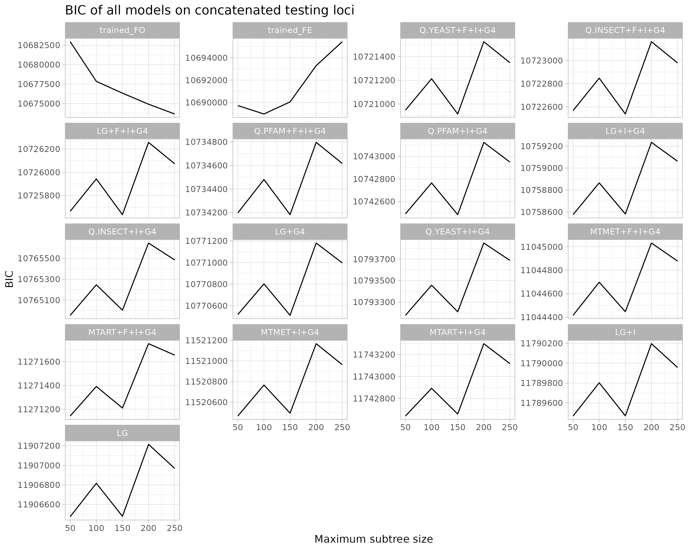
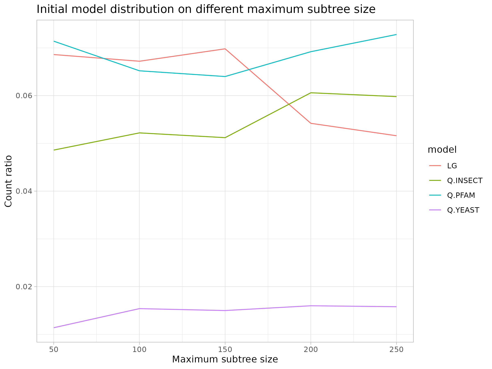
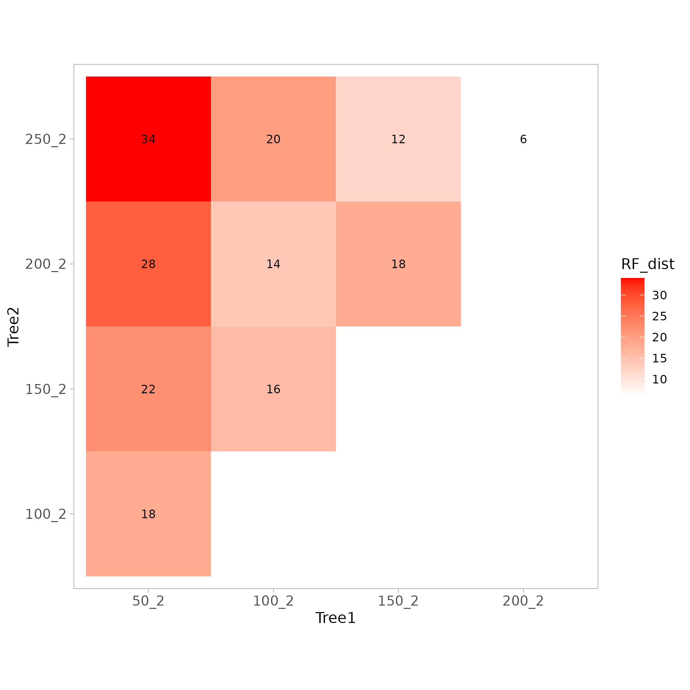
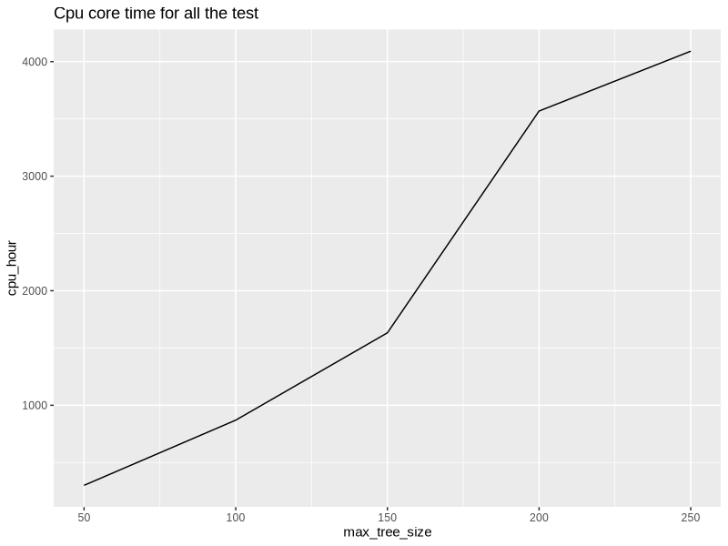
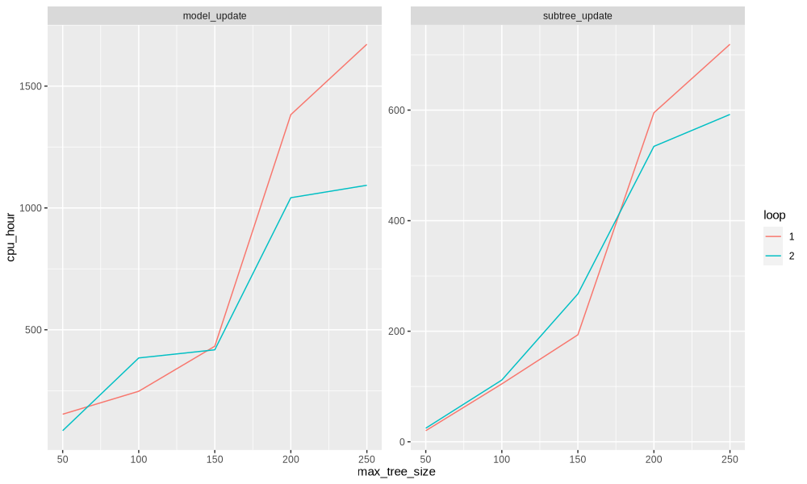

### BIC Change with Maximum Tree Size

Using the test loci under Concatenate, the final model is evaluated under the tree inferred from the final model and the best BIC values under other initial models to assess whether the inferred model is better. In tests with five different maximum subtree sizes, the best BIC model is always the combination of the trained model + FO. The best BIC changes with the maximum subtree size as shown below:  
  
The improvement in BIC is most noticeable when the maximum subtree size is between 50-100. In the range of 100-250, the BIC shows a generally linear decline. This is as expected because as the maximum subtree size increases, the average size of the subtrees increases, and the amount of information contained in each alignment increases, which generally leads to better model estimation.  
  
The BIC values of all other models as the maximum subtree size changes are also listed. The arrangement of the facets in the image is in the order of the minimum BIC in the image. It can be seen that the combination of the trained model + FO is the best, followed by the combination of the trained model + FE, and the BIC values of other models are always higher than these two models (even the maximum value). At the same time, only the BIC of the trained model + FO shows a consistently decreasing trend, while the BIC obtained by applying FE to the trained model almost always increases, indicating that the impact of the difference between the balanced frequency and the actual frequency is continuously expanding. Meanwhile, the BIC values of other models show a fluctuating upward trend, with a significant drop at 150.

### Initial Models Changing with Maximum Tree Size

  
This image shows an interesting fact. In different tests, the size of the subtrees affects the distribution of the best initial model assigned by ModelFinder for each subtree. Overall, the proportion of the LG model is continuously decreasing, while the proportion of the three QMaker models is continuously increasing. Larger subtrees seem to be more inclined to choose these models.

### Difference in Final Tree

### PCA Analysis

No obvious pattern was found in the PCA image as the maximum subtree size increases.

### Time usage
  
The graph shows the CPU time usage (current occupied cores * time) for different maximum subtree sizes. Ideally, the total CPU time consumed should exhibit an exponential increase. However, the tests with subtree limits of 200 and 250 resulted in similar subtrees, so there wasn't a significant increase in time consumption.  
  
Also provide the CPU time usage for different maximum subtree sizes.

### TODO

- [ ] Add ref_tree + trained models / initial_models to BIC comparison
- [ ] Integrate inner loop LogL check to analysis (also add to main script)
- [ ] Try to get the best trained model for different subtree sizes
- [ ] Add cross test to check ref_tree x trained_model and new_tree x initial_model