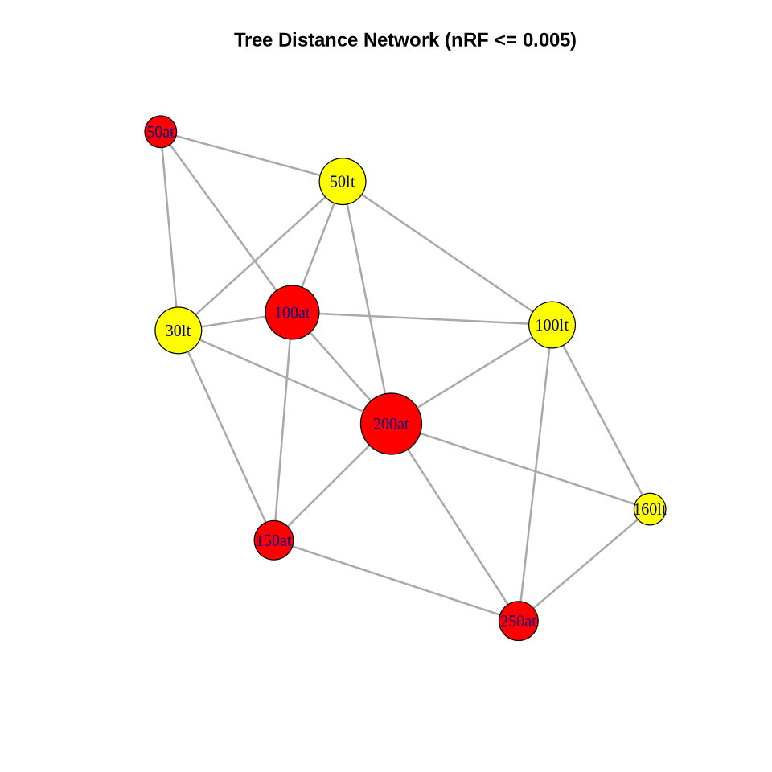

## Intro
This folder's content primarily aims to test the impact of different subtree selection methods and ModelFinder constraints on model inference.  
The folder naming convention is {Taxa level}\_{Taxa name}\_{subtree select method}\_{ModelFinder constraint}.  
Other files within the folder are named {Taxa level}\_{Taxa name}\_{Maximum subtree size}.  

## Type of Test
### Subtree Selection Method
All subtree generation strategies are as follows: First, a reference tree is specified, and the tree is split into two subtrees at the root node. Then, the generated subtrees are continuously split at the root node according to a certain strategy, and the smaller subtrees are discarded until the specified number of subtrees is reached.
- **at**: Represents All subtrees. A maximum number of tips for the subtree is specified, and subtrees with more tips than this value are continuously split until no subtree has more tips than this value. This strategy can obtain both deep and shallow branches, generating subtrees that consider multiple evolutionary histories.
- **lt**: Represents Largest subtrees. A maximum number of tips for the subtree and the desired number of subtrees are specified. The largest subtree is selected for splitting at each split until the specified number of subtrees is reached. This strategy can obtain as many deep branches as possible to ensure that the subtrees have high-quality evolutionary information.

### ModelFinder Constraint
- **nc**: Represents No constraint. No constraints are applied to ModelFinder.
- **tc**: Represents Topology constraint. The topology of the subtrees obtained under the reference tree is directly used as a constraint for ModelFinder.

## Result
The current tests have only been done in the *Acidobacteriota* phyla and only compared the selection strategies of two subtrees.  
Our results are mainly analyzed from two aspects: 
1. Consistency of model inference results; 
2. Consistency of trees inferred under the model. 
Therefore, we mainly use two indicators for analysis: 
1. Pearson correlation coefficient between amino acid substitution rate matrices（Cor.Q）; 
2. Normalized RF distance between trees inferred under the model.

### Consistency of Model Inference Results
All models' substitution rate matrices, parameter vectors, and equilibrium frequencies' Pearson correlation coefficients and Euclidean distances were calculated. The results are saved in: [Model Dist/Cor](./p__Acidobacteriota/trained_models_dist.csv).  

  
  
From the PCA plots, it can be seen that the consistency of substitution rates and equilibrium frequencies of models obtained under the at strategy is higher than that of models obtained under the lt strategy (more distributed at the edges of the image).  
Using 0.999 as the threshold, a heatmap of the Pearson correlation coefficients between substitution rate matrices was drawn:  
  
It can be observed that under the same strategy, a larger subtree size limit brings higher parameter consistency. Even between different strategies, a larger subtree size limit can bring almost the same model inference results. If 0.998 is used as the dividing line, the model inference results obtained under the at strategy with a subtree size limit of 150 are almost consistent. The 250lt test obtained a very different result, and the likelihood value of the model on the test set was significantly lower than that of the 160 and 100 subtree size limit tests under the same strategy. We believe this may be due to the lack of root introduction in the iterated subtrees, leading to a more significant impact of midpoint rooting when selecting a few larger subtrees, resulting in more unstable model inference.  
  
Using 0.998 as the threshold, we also drew a graph representation of the relationships between models, with the two strategies represented in different colors. It can be seen that the relationships between models under the at strategy are closer, while the relationships between models under the lt strategy are more dispersed. It is also very significant that similar subtree size limits result in similar model inference results.  

### Consistency of Trees Inferred Under the Model
All models' trees (including the reference tree) were calculated for RF, nRF, wRF, SPR, and Path distances. The results are saved in: [Tree Dist](./p__Acidobacteriota/tree_pairwise_compare.csv).  
Using nRF distance as an example, with 0.005 as the threshold, a heatmap of nRF distances between trees was drawn:  
  
The deeper the blue, the more below the threshold; the deeper the red, the more above the threshold. We obtained similar conclusions to the consistency of models: 
1. The consistency of trees inferred under the at strategy is higher;
2. Similar subtree size limits between different strategies result in similar trees. The anomaly of the 250lt test is more significant here;

Under all strategies and subtree size limits, the nRF distance between the inferred trees and the reference tree is always above 0.16. If we take 5% of this value as a nearly identical threshold (i.e., 0.008) and draw a network graph:  
  
It can be seen that the nRF distances between trees within a subtree size limit of ±100 under the at strategy are nearly identical, further demonstrating the stability of the at strategy. Under the lt strategy, only the tests of the adjacent levels are connected, and the 250lt test is not connected to any test.  